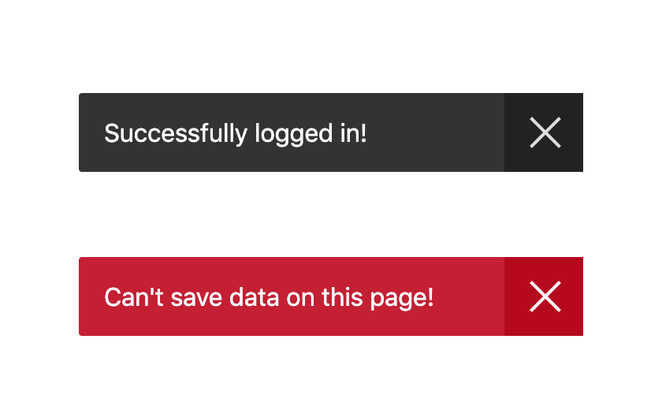

# Crostini

### A super simple toast notification

```
npm install crostini
```

```javascript
import crostini from 'crostini';

// show a regular notification
crostini("Can't save data on this page");

// show an error notification
crostini("Can't save data on this page", {type: "error"});
```




### Original Project

This library is based on a Pen by Pierre Smith: 
https://codepen.io/kipp0/pen/pPNrrj